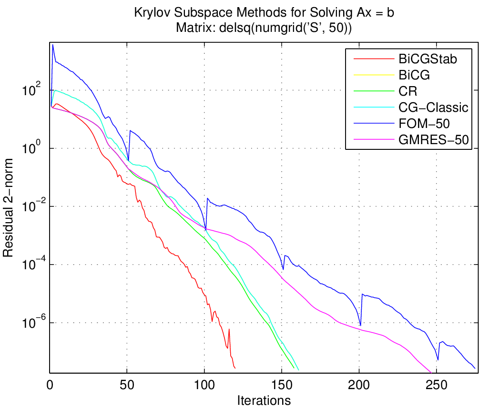

# Krylov Subspace Methods (Iterative Solver)

Some "byproducts", or say "formula translations" of my course CSE 6644 / MATH 6644. :)

Naïve implementations of some Krylov subspace methods without preconditioning: 

* Restarted Full Orthogonalization Method (FOM)
* Restarted Generalized Minimum Residual Method (GMRES), with Arnoldi / Householder orthonormalization
* Conjugate Gradient (CG), 4 different versions
* Conjugate Residual (CR)
* Biconjugate Gradient without/with Stabilized (BiCG/BiCGStab)

For symmetric system only: CG (S.P.D. matrix), CR (Hermitian matrix)

## Solver Interfaces

### Common Input Parameters and Output Values

`[x, converged, iter_cnt, res_norm] = Solver(A, b, res_tol, max_iter, ...)`

Solve $x$ for $Ax=b$ s.t. $\|b-Ax\|_2 \le \|b\|_2 \cdot res\_tol$ with at most $max\_iter$ iterations. `converged` marks whether the solver converged to given tolerance within given maximum iterations. `iter_cnt` is the number of iterations the solver has executed. `res_norm` is a vector that contains the residual norm of each iteration.

Default value for `res_tol` is $1e-9$.

### Input Parameters for FOM

`[x, converged, iter_cnt, res_norms] = FOM(A, b, res_tol, max_iter, restart)`

FOM will restart every `restart` inner iterations, the total number of iterations will not exceed `restart * max_iter`. Default value for `restart` is `min(10, size(A, 1))`, for `max_iter` is `min(size(A, 1) / restart, 10)`.

### Input Parameters for GMRES

`[x, converged, iter_cnt, res_norm] = GMRES(A, b, res_tol, max_iter, restart, use_HH)`

GMRES will restart every `restart` inner iterations, the total number of iterations will not exceed `restart * max_iter`. If `use_HH == 1`, GMRES will use Householder orthogonalization; otherwise GMRES will use modified Gram-Schmidt (Arnoldi) orthogonalization.

Default value for `restart` is `min(10, size(A, 1))`, for `max_iter` is `min(size(A, 1) / restart, 10)`, for `use_HH` is $1$. 

## A Simple Comparison 

## Reference

1.   Yousef Saad, *Iterative Methods for Sparse Linear System (Second Edition)*, Philadelphia: SIAM, 2003 [Online Access](http://www-users.cs.umn.edu/~saad/IterMethBook_2ndEd.pdf)
2.   A.T. Chronopoulos, C.W. Gear, *s-step Iterative Methods for Symmetric Linear Systems*, SIAM J. Computational and Applied Mathematics, 1989, pp. 153-168
3.   P. Ghysels, W. Vanroose, *Hiding Global Synchronization Latency in the Preconditioned Conjugate Gradient Algorithm*, Elsevier, J. Parallel Computing, Vol 40 No 7, 2014
4.   MATLAB built-in function `gmres`, path: `MATLAB_INSTALL_DIR/toolbox/matlab/sparfun/gmres.m`. 
5.   Netlib, MATLAB templates for the *Solution of Linear Systems: Building Blocks for Iterative Methods (2nd Edition)*, [Online Access](http://www.netlib.org/templates/matlab//)